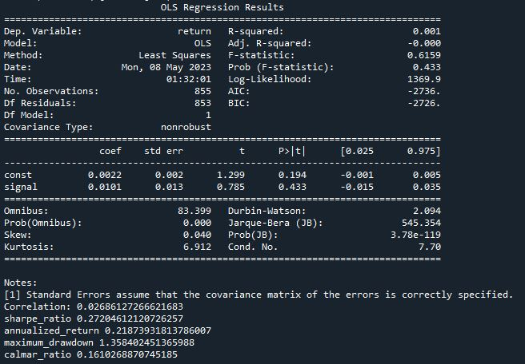
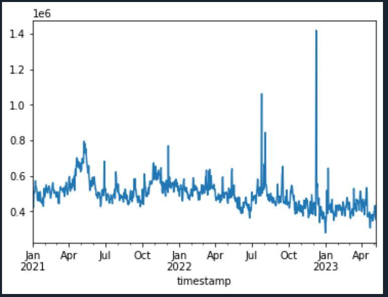

# eth_backtest_analysis_sample

This is a data analytics project to backtest the strategy of trading Crypto using Python, Biannce API and Glassnode API.

## Step 1 - Define the question

My question of this project is what is the factor that can help me build an effective and profitable trading strategy for crypto e.g. ETH.

With this analysis, I am going to find out if the factor I choose is useful or not e.g. the number of active addresses of ETH, to trade ETH.

## Step 2 - Collect the data

Data are collected from Glassnode and Binance API.

e.g. the number of active addresses of ETH from Glassnode

Link: https://studio.glassnode.com/metrics?a=ETH&m=addresses.ActiveCount

## Step 3 - Clean the data

Data are cleaned by Pandas so that I can merge the data from Glassnode and Binance for analysis.

## Step 4 - Analyze the data

An Ordinary least squares (OLS) regression was run to check if the factor was statistically significant or not.

e.g. the number of active addresses of ETH is NOT statistically significant to ETH price and this strategy has low shapre ratio and calmar ratio, so this is not an ideal strategy. (But for demonstration purpose, the analysis will go on)

## Step 5 - Optimize the strategy

Find out the range of the signal(the number of active addresses of ETH) and run all the combinations to find out the best combination of parameters for strategy optimization.

e.g. 

## Step 6 - Visualize the results

First compare the profit and loss with the benchmark e.g. buy and hold

e.g.

Then check the heatmap to understand if this strategy can be applied to real situation in the future. 

## Step 7 - Review the strategy

Some requirements for a good daily strategy:

   * Sharpe ratio 1.5 - 2  

   * Calmar ratio 2 - 2.5

   * High trading freq

   * Fast recovery time
   
   * Higher return and lower risk than benchmark(buy and hold)
   
   * Less risk to be applied in the future

